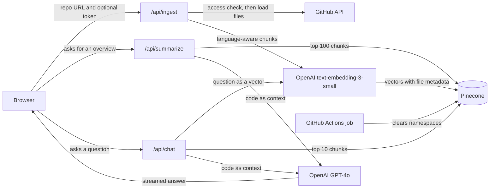

# Codebase Intelligence

A Retrieval-Augmented Generation (RAG) application for intelligent codebase analysis. Upload any GitHub repository and get instant AI-powered insights, summaries, and context-aware Q&A about your code through semantic search and vector embeddings.

## Demo

Watch the demo on YouTube: https://youtu.be/eKBP3mmAprc

[](https://youtu.be/eKBP3mmAprc)

[](https://nextjs.org/)
[](https://reactjs.org/)
[](https://www.typescriptlang.org/)
[](https://openai.com/)
[](https://www.pinecone.io/)
[](https://langchain.com/)

### Problem Statement

Understanding large, complex codebases and navigating massive GitHub repositories is a major bottleneck for developers onboarding or trying to debug unfamiliar legacy code. I wanted to build a tool that allows engineers to interact with their code context-awarely and get instant, accurate architectural answers.

### Impact

The project bridges the gap between raw, multi-file code syntax and semantic vector search, letting developers ask natural-language architectural questions about an unfamiliar repository and get grounded, code-informed answers. The goal is to shorten the time spent reading through a large codebase before becoming productive in it — a common bottleneck during onboarding or when debugging unfamiliar legacy code.

## Features

- **Repository Analysis**: Automatically analyze GitHub repositories and extract meaningful insights
- **Project Summarization**: Generate AI-powered summaries including tech stack, architecture patterns, and code statistics
- **RAG-Powered Chat**: Ask natural language questions and receive context-aware answers by retrieving relevant code snippets and augmenting LLM prompts
- **Vector Embeddings**: Uses Pinecone vector database for semantic search and efficient code context retrieval

## Architecture



## How it works

- **Ingestion.** Before doing any expensive work, `/api/ingest` asks the GitHub API whether the repository is actually reachable with the given token, and uses the same call to resolve the default branch — so a bad URL, an expired token, or a rate limit comes back as a clear message instead of a stack trace halfway through a load. Each repository is indexed into its own Pinecone namespace, and a repository that already has vectors is skipped rather than embedded twice.

- **Chunking.** A RAG system is only as good as its chunks: each chunk becomes a single embedding, so a chunk that splits a function in half produces two vectors that each represent an incomplete idea. Instead of fixed-size character windows, files are grouped by the language detected from their extension and split with language-specific separators via LangChain's `RecursiveCharacterTextSplitter.fromLanguage()`, which prefers to break between functions and classes rather than through them. TypeScript/JavaScript, Python, Go, Rust, Java, C/C++, Ruby, PHP and more are handled this way; non-code files such as JSON, YAML and CSS fall back to a generic recursive splitter so nothing is dropped from the index. This is heuristic, separator-based splitting rather than a full tree-sitter AST parse — a deliberate tradeoff that captures most of the benefit without per-language parser dependencies.

- **Retrieval.** Questions and code are embedded with the same model, so a question can be matched against code by meaning rather than by keyword. Every query is scoped to one repository's namespace: `/api/chat` pulls the 10 closest chunks for a question, while `/api/summarize` pulls 100 and derives the file count, language mix and rough line count from the metadata that came back with them.

- **Answering.** Retrieved code is placed in the system prompt, so GPT-4o answers from the repository in front of it and is told to say so when something isn't in the context. Answers stream to the browser token by token and render as markdown; the route records how long embedding and retrieval took and when the first token arrived, and returns the retrieval timings as response headers.

- **Validation.** Every route parses its body with a Zod schema before touching an external service, so malformed input is rejected at the edge with a field-level message and the handlers below can rely on their types.

- **Cleanup.** Indexing repositories costs storage, so a scheduled GitHub Actions workflow clears the index's namespaces nightly. The demo stays cheap to host, and re-running a repository simply re-ingests it.

## Tech Stack

### Frontend & Backend
- **Next.js 16** - React framework with App Router and API routes
- **React 19** - UI framework
- **TypeScript** - Type safety
- **Tailwind CSS** - Styling
- **Zod** - Runtime type validation

### AI & Vector Database (RAG Stack)
- **LangChain** - Document loading, chunking, and LLM orchestration
- **Pinecone** - Vector database for semantic search and retrieval
- **OpenAI** - GPT-4o for generation, text-embedding-3-small for retrieval

## Getting Started

### Prerequisites

- Node.js 18+
- Git
- OpenAI API key
- Pinecone API key
- GitHub Personal Access Token

### Installation

1. Clone the repository:
```bash
git clone <repository-url>
cd codebase-intelligence
```

2. Install dependencies:
```bash
npm install
```

3. Set up environment variables:
```bash
cp .env.local
```

### Development

Start the Next.js development server:

```bash
npm run dev
```

The application will be available at `http://localhost:3000`

### Build

```bash
npm run build
```


## Validation

- **Zod Schemas** for request validation across all endpoints
- Type-safe API responses with TypeScript inference
- Client-side validation before API calls

## Contributing

This project is open source and contributions are welcome! Feel free to open issues, submit pull requests, or suggest improvements.

